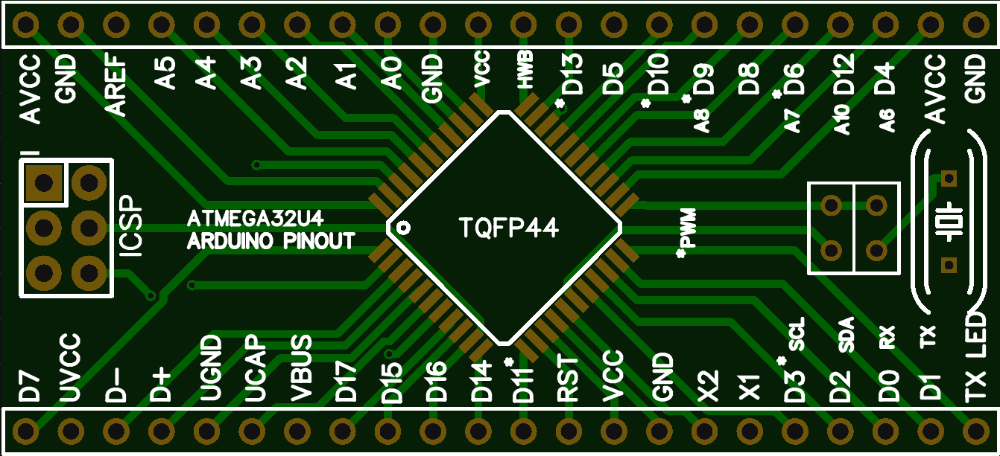
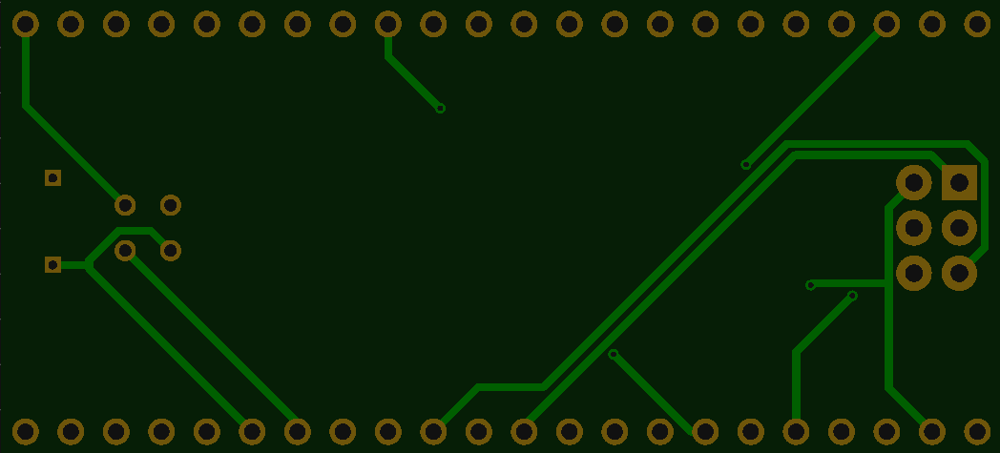
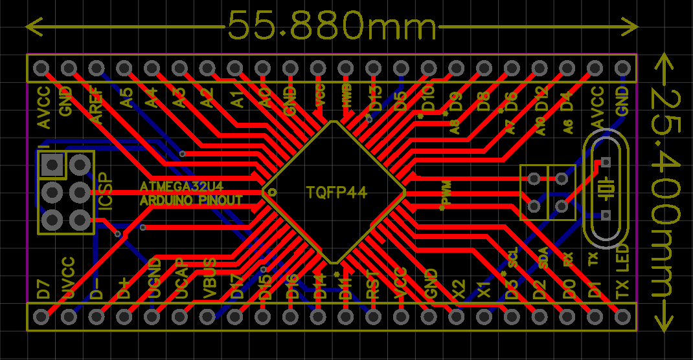
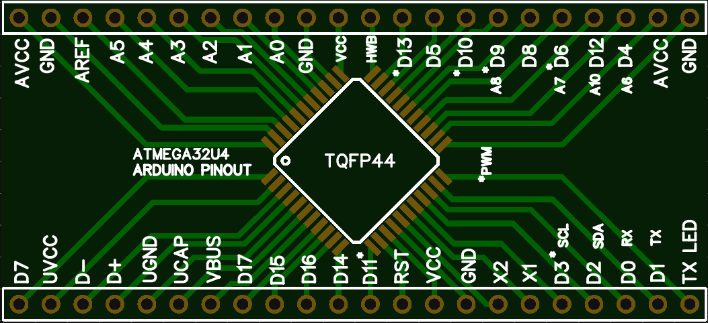

# ATMEGA32U4-BREAKOUT

* Breadbaord friendly
* It based on EasyEda
* Very detailed, informative
* Icsp headers included
* Pin names included
* Crystal and capacitor holes included
* There is also one layer version

## Top Side

## Bottom Side

## Full Board

## One Layer Version

