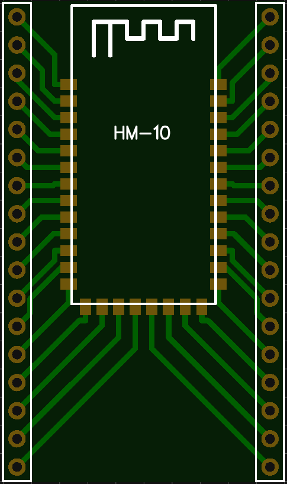
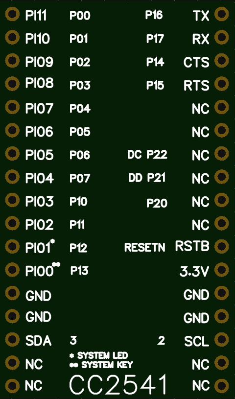
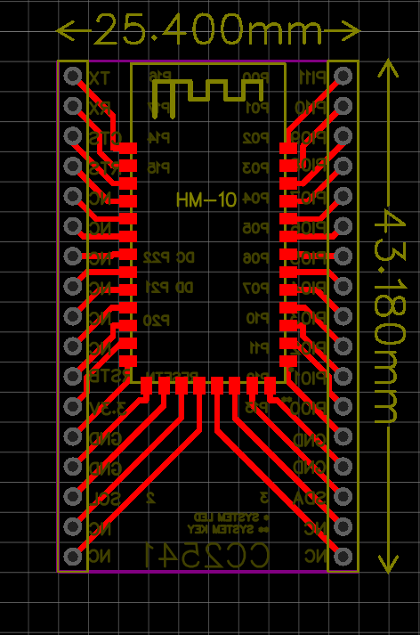

# HM-10-BREAKOUT
A breadbaord friendly HM-10 Breakout
* Breadbaord friendly
* It based on EasyEda
* Very detailed, informative
* CC254X's pin names included to the bottom layer

## Top Side

## Bottom Side

## Full Board

