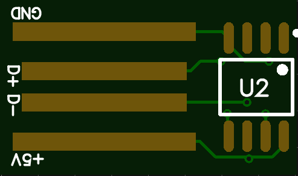
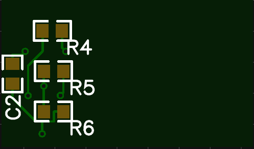
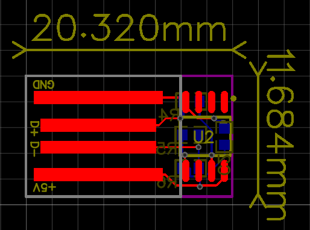
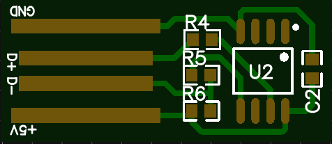
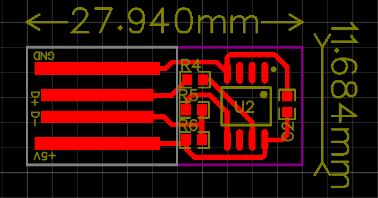
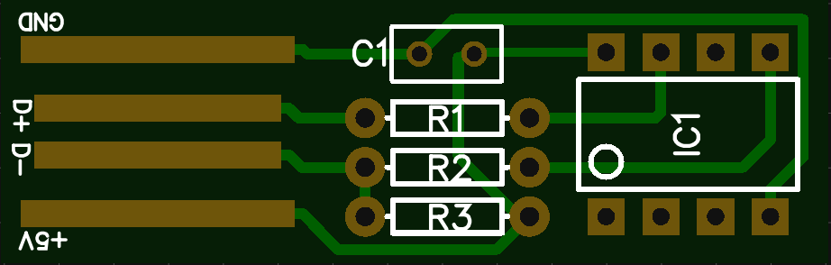
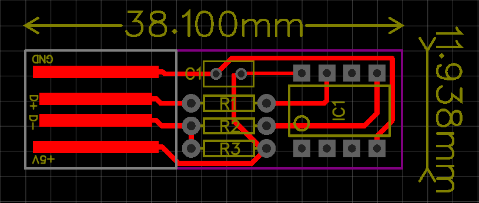

# CapsLocker

A clever prank device, there is three pcb version for produce the device; smd, one layer smd and dip version. 

It based on attiny45. you can find more details on this old blog post: http://macetech.com/blog/?q=node/46

## Top Side::SMD

## Bottom Side::SMD

## Full Board::SMD

## Top Side::SMD ONE LAYER

## Full Board::SMD ONE LAYER

## Top Side::DIP

## Full Board::DIP

